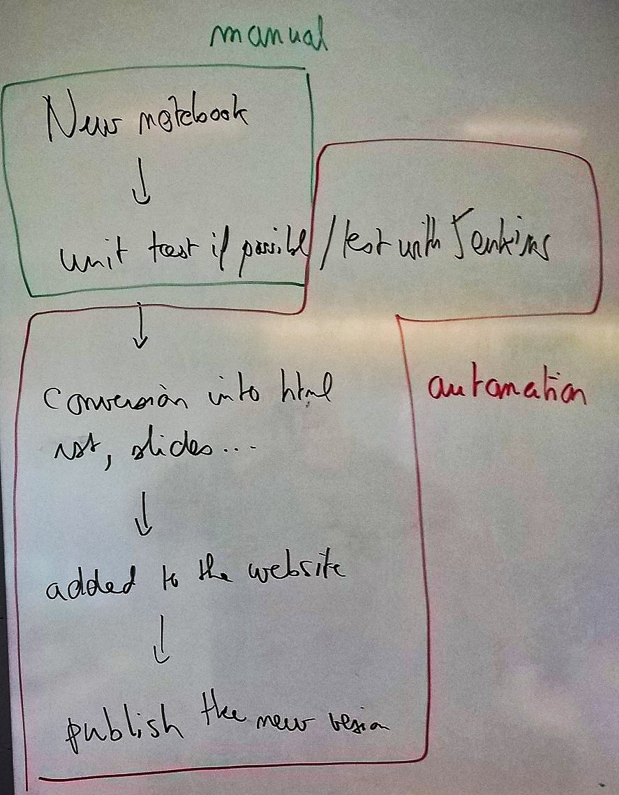

Tutorial
========

.. contents::
    :local:

The module *pyquickhelper* is mostly used to automated the testing
of all the materials I use for my teachings in
French `Python dans tous ses états <http://www.xavierdupre.fr/app/ensae_teaching_cs/helpsphinx/index.html>`_
or English such as this module. Everytime I create a new notebooks, it is being added
in a specific place in the documentation `_doc/notebooks`, a unit test is created to test
it every week and check it does not break with a module update, it is then converted into HTML, Slides
and inserted into the documentation as a RST file.

The initial purpose of *pyquickhelper* was to automate most of the pipeline
above. It is currenly automating all the red parts. The implementation introduced
many functions and classes which can be used independently from this process.
That's what the tutorial is about. Next section introduces the
main functionalities. A couple of them will be detailed later.
*pyquickhelper* requires many tools to convert notebooks into many formats
including PDF. The list is detailed at
:ref:`dependencies and tools <l-dependencies-tools>`.

.. toctree::

    sphinx
    fileh
    cli
    unittest
    mainf
